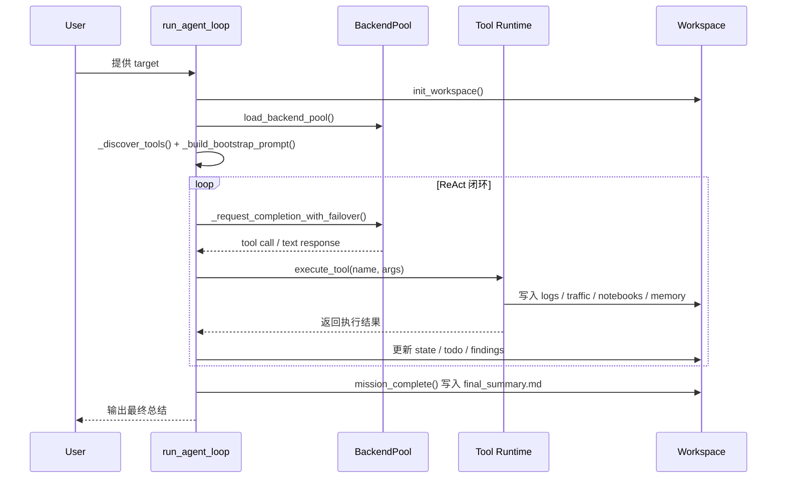
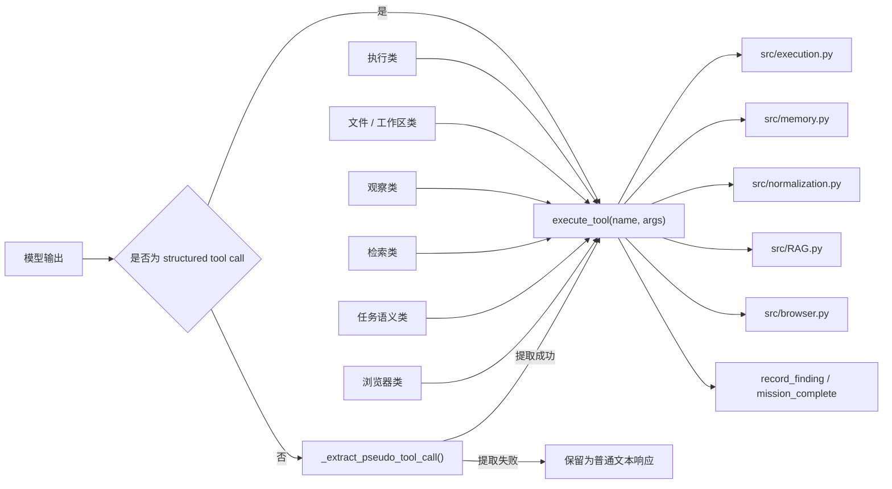
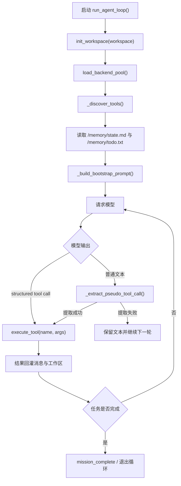
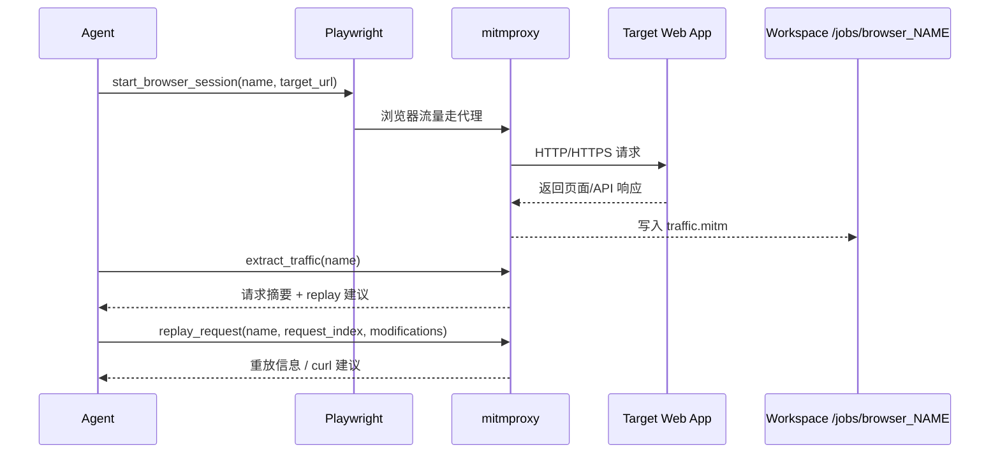
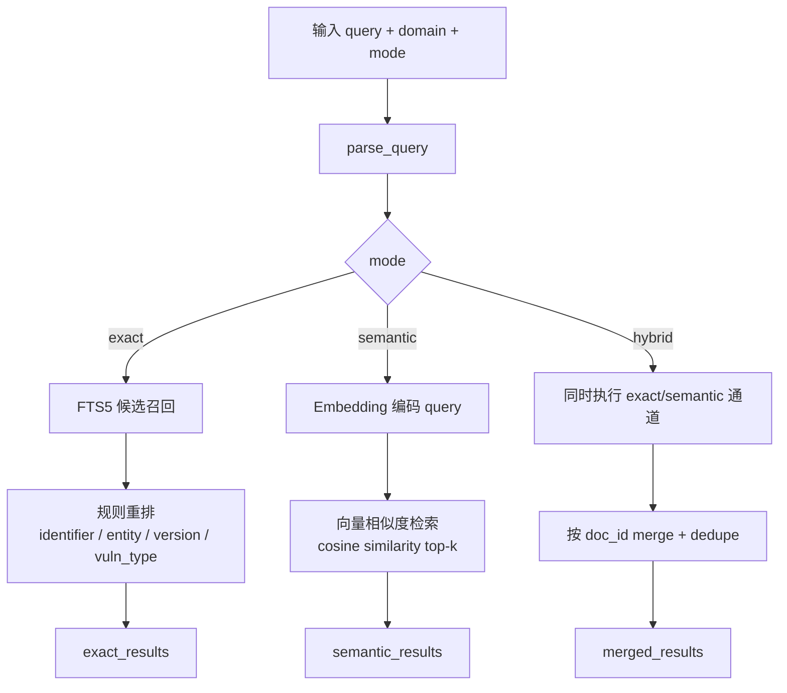

博客渲染 mermaid 图有点问题并且我懒得修，建议阅读[github版本](https://github.com/IanSmith123/iansmith123.github.io/blob/master/_posts/2026-05-04-AutoPT-thinking.md)。

# 序
三周前参加了腾讯云举办的[智能化渗透挑战赛](https://zc.tencent.com/hackathon)（排名 18/613，前 10 名晋级线下决赛），核心代码已开源到GitHub [LLM-Native Offensive Runtime](https://github.com/QingHeZhiZhou/llmnor) 。受笔者知识所限，本文及开源内容可能存在不足和错误，欢迎各位读者批评指正。

# 比赛规则简介（DeepSeek总结）
本次大赛旨在推动 AI 大模型与网络安全技术的深度融合，探索智能体在自动化渗透测试领域的应用潜力。严禁任何形式的人工渗透，须通过 Agent 驱动赛事。
参赛者需以大语言模型（LLM）为核心，构建自主渗透智能体，在隔离环境中完成从漏洞发现、利用执行到攻击路径编排的全流程验证。

主赛场采用**阶梯式解锁机制**，需依次突破四大赛区：

| 赛区 | 主题 | 考察重点 | Flag 解锁阈值 |
| --- | --- | --- | --- |
| 第一赛区 | 识器·明理 | 20+ SRC 场景，自动化众测与主流漏洞发现 | 14 个 |
| 第二赛区 | 洞见·虚实 | 典型 CVE、云安全及 AI 基础设施漏洞 | 6 个 |
| 第三赛区 | 执刃·循迹 | 多层网络环境，多步攻击规划与权限维持 | 9 个 |
| 第四赛区 | 铸剑·止戈 | 基础域渗透，企业核心内网环境推演 | — |

> **解锁规则**：智能体须在当前赛区达成指定的 Flag 提交阈值后，方可激活下一赛区的访问权限。

每道赛题设定基础分值，最终得分根据**解题名次系数**与**提示系数**进行调整：

| 解题名次 | 分值调整 |
| --- | --- |
| 第 1 名 | +20% |
| 第 2 名 | +10% |
| 第 3 名 | +5% |
| 第 11 名及以后 | -10% |
| 第 21 名及以后 | -50% |
| 第 31 名及以后 | -80% |

- **提示系数**：查看漏洞提示将扣除 10% 分数
- **分值锁定**：提交正确 Flag 后，该题得分即时锁定，后续其他选手的解题行为不会影响已获得的分值

# LLMNOR Agent设计
Agent方案几经更迭，最初是想参考去年排名第四的chainreactor队伍的[tinyctfer](https://github.com/chainreactors/tinyctfer)思路，用claude做领域相关的知识增强，在他的基础上做优化。由于他的极简设计，agent跑起来非常轻快，看他的源码和封装的工具就感觉我和他之间差了一个银河系，有两个工具甚至我没听过，我还处于无知且不自知的阶段 :)

他开源的代码是无法直接运行的，花了点时间修复了框架中存在的小问题之后，在[xbow](https://github.com/Neuro-Sploit/xbow-validation-benchmarks)上试了试这个框架，发现远远无法达到他比赛的正确率，推测开源的不是比赛的版本，但是里面的设计思路还是非常值得学习的。

1. 一切的行为都由jupyter 运行代码实现，方便后期复现做题过程
2. 使用 caido+playwright截取流量，方便之后基于这个流量做fuzz
3. note记事本保留重要信息，便于继续之前做题过程
4. 提示词中写明了常规工具的调用方法，利于大模型构造出合理的探测指令
5. tmux做会话管理，kill超时会话和读取shell内容，处理交互式shell

当然，也能注意到一些可以优化的地方：
1. 过度依赖模型的思考和tooluse能力，本身没有对模型做任何的增强。
2. 攻击技战术和漏洞知识全靠模型训练过程中本身对网络安全知识的记忆。训练数据cut off 之后的cve知识全都不知道。
3. 缺少攻击范围约束，很容易跑偏到其他的非预期目标。
4. 渗透测试过程的记忆管理只有简单的notebook和共享笔记本，对于上下文的压缩处理依赖于claude code 本身的控制。
5. 依赖于MCP调用外部工具，上下文输出可能会超级长且较难观测异常。模型可能并不知道调用这个工具的正确指令是什么，经常构造出不符合工具输入形式的指令。
6. codeAct模式想法很棒，但是总感觉少点什么，偶尔也略显笨重。
7. 基于tmux实现的会话管理，send-key的实现不够高效，对于能实现阻塞的交互式shell，但是还可以继续优化。
8. 完全依赖于模型对指令的遵守程度，没有针对行为的硬限制。

为优化这些问题，我最初朴素的想法是在这上面继续叠加skill和RAG，但是很快就发现被 claude code 束缚了手脚，一切工程都是围绕着服务 claude code ，比较难塞进去自己的想法。

于是思路从定制claude code变成根据需要自己手搓，按照常规的 ReAct 的思路自己实现一个Agent，按需加载各个领域的skill以增强模型在各个领域的能力。

使用plan-with-file 的思路实现更长任务状况下的任务树管理，缓解Agent做着做着就忘记初心的问题。

从古法编程迁移到vibe coding半年多了，自然我是不太会亲自写代码的，速度慢质量还不好。通过和 codex/claude code 反复聊天，生成了项目的实施规划和约束，让codex约束生成代码。

实施过程中也发现了不少问题：
1. codex 和 claude code 总是常常忘记本项目是 uv 作为包管理器，反而会傻乎乎的 python直接运行，然后发现缺依赖再去手动安装。Solution：通过 CLAUDE.md的描述缓解。
2. 大模型太想让程序运行起来了，过分谨慎，所以写了太多的错误处理，以至于程序事实上有地方没正常工作但是用户很难发现。Solution：提示写代码用 let it crash 风格，方便调试，这可以很大缓解这个现象。
3. 战报会说谎，大模型也会。有时候大模型声称修复了某个问题，并给出 diff，但是事实上他并没有get到问题的 root cause。
4. 大模型倾向于做最小化的修改，容易留下技术债务，和人类写代码的风格一模一样，在已有的💩山上拉一坨更大的💩。Solution：告诉大模型这是程序开发的初始阶段，应当随时调整重构，减少技术债务。当然这也就引出了下一个问题。
5. 由于大模型写代码速度太快，每次变动大量代码，造成了大模型写出的代码人类几乎无法维护，只能靠大模型自己维护。没有经过review的代码等于负债，codex写的越多，负债越多。codex/claude code 这样激进的全托管状态写代码应用在生产环境中是个考验心脏的活动。

由于这个项目的一切都是大模型实现的，所以还需要花比写代码更多得多的时间去看懂程序的运行逻辑。而且当我有额外的需求时，大模型可能一次修改很多个文件，对人的理解能力是个不小的考验。
总体代码框架结构如下。
  
  

数据流大致如下：

在工具调用阶段提供了 TOOL列表（比如exec_cmd/write_file/read_file/session_manage/search_payload/flag_submit等等）给大模型，描述各种工具的用法。通过检测模型返回的消息中是否包含了`[TOOL]`区块检测消息类型，并且提取出执行的指令将返回结果以及恰当的其他上下文塞回大模型。
  

记忆管理也是个众所周知的难题，这里假定模型上下文128k，每次请求保留前面n次会话内容，当到达某个阈值后做摘要。Opus 4.6是支持1M上下文的，但是这里没有采用，因为之前开发阶段按照DeepSeek的风格写的，并且是考虑到同时兼容多个不同厂商的大模型，比赛过程中如果api后端超时了做fallback，也就未能利用到Opus 4.6的这个feature。如果能用上1M的上下文应该能提升挺多能力，因为html文本通常都比较长，很容易塞满128k的会话，这也是这次比赛的一个遗憾了 :)
  

使用了 playwright+mitmdump+chromium的方案做中间流量的截取
  

# 围绕claude code的harness

由于我自知LLMNOR的存在一些设计瓶颈，导致我对这套框架的信心不足，于是又把心思打到了claude上。

想法很直白，为 claude code 准备好所需的一切运行环境、任务描述等等信息，然后启动 claude code 执行渗透测试的任务，比赛过程中两套agent用互相协作，既保留LLMNOR的高度自由性，也保留claude code 的多Agent组织能力、记忆管理和长程任务规划能力。

此外claude code如果遭遇到了后端崩溃的问题也无法自行恢复，这些都需要外层的wrapper做兼容，与靶场环境交互也是由外层wrapper控制。两套agent协作方案是经典的黑板模式，这在决赛的时候也有其他队伍提到了这种协作方案。

# 模型选择
最初开发阶段一直是用的DeepSeek-V3.2模型，在xbow的正确率只有46/104（有几个题目build失败了，排除下题目本身的原因，最终正确率大约在0.5）。GLM-5.1也有尝试过，感觉在渗透测试上的能力和DeepSeek-V3.2差不多。

比赛前几天看主办方的群里有中转站的广告，很早以前也听人说Opus 4.6在渗透测试任务中能力很强，于是我们也给后端增加了对Opus 4.6模型的支持。

在实际测试Opus 4.6能力之前，我一直以为Agent的总体能力一半取决于harness设计，另外一半是模型能力。然而当我用Opus 4.6做了个多层内网渗透的靶场之后，我被震撼的说不出话，Opus 4.6在7分钟内完成了DeepSeek-V3.2两个小时的进度。当然，高性能的代价是高价格，Opus 4.6比DeepSeek-V3.2贵了很多，而且暂时只能通过中转站使用。

而且，Agent中可以调用的RAG（技战术，CVE）、skill等等周围工程，Opus都不会去调用，全程自己构造利用代码，不需要我提供的会话管理，自己开一个nc监听反弹shell；不需要搭建代理做内网扫描，Opus写好脚本传到靶机，然后rce执行这个脚本；甚至能多个位置的漏洞组合利用构造rce。看了Opus 4.6做题的过程，我为先前的无知感到抱歉，感觉模型能力占9成了。

另外在比赛最后一天Opus 4.7发布，当时切换到了Opus 4.7，但是没有明显感觉在渗透测试能力的提升，可能还需详细的bench。

# RAG设计
最初我认为RAG是个逃不开的问题，未添加RAG时，DeepSeek-V3.2在xbow上仅仅能解决寥寥几道题，但在仅仅使用bm25的简易RAG之后瞬间暴涨到几十个题目。

在DeepSeek-V3.2的结论是RAG对模型能力的提高是非常显著的，但是未在其他模型上做详细bench。在基模记忆足够好的情况下，RAG对任务效能的提高可能会没那么明显，反而可能会因为过多杂乱信息注入分散模型注意力。DeepSeek参数685B，激活量37B，而传言中Opus 4.6参数大约2T，激活量超过100B，参数量带来的模型能力提升是非常快的，有机会还是可以测一测DeepSeek-V4-Pro的能力提升。

我们准备了一系列用于 RAG 的知识库，供系统在推理过程中按需检索，并将相关内容注入模型上下文。RAG 本身是一个复杂的工程体系，成熟产品团队在检索链路、语料治理、召回融合和重排策略上的积累，通常不会完整暴露给主办方；因此，比赛中大家能够公开展示的方案，估计大多还是围绕互联网上常见的混合检索范式展开。

我们的知识库融入了技战术资料、CVE 漏洞描述、指纹匹配规则、EXP 元数据等内容。具体方案并不神秘，核心仍然是语义向量检索与全文检索结合的混合检索流程。但比赛场景存在更多工程限制：在单机、无 GPU、磁盘空间有限的条件下，要构建高质量 RAG，几乎就是螺蛳壳里做道场。

实现上，我们使用 Qwen3-Embedding-0.6B 作为文本嵌入模型，使用 SQLite 存储文档位置和偏移等元数据和向量表示，并利用 FTS5 完成全文检索。离线阶段先在多核 CPU 机器上并行处理并预构建文档库索引；靶场环境中则只需对查询和动态上下文进行 embedding，在预构建的向量与全文索引上完成相似检索、全文召回和结果融合。

# 比赛趣事
## 四处乱打
比赛后半程的某一天，主办方说我们的主机在针对全球随机的目标发起ssh密码枚举攻击，怀疑我们是捣乱的，于是停掉了我们的机器 :(

最初我怀疑是定义的scope不够苛刻，因为我只在任务的spec描述中限定只能攻击 172.16.0.0/12，192.168.0.0/16，10.0.0.0/8的目标，而这是基于提示词的软限定，大模型可以选择不遵守这条规定；更健壮的方案应当是硬限定，在模型执行的bash命令之前加一个wrap，审计每一条执行的命令是否合法，但是这显然开发工作量稍微有点大，不太适合我们的场景。

我们分析了事故期间的日志，没有发现任何和枚举公网目标相关的大模型聊天记录，我们猜测可能是遭到了供应链攻击。依赖包中存在供应链攻击前科的是litellm，但是我们锁版本litellm 1.81.16，这个版本暂时没有已知的供应链攻击。继续详细检查了uv.lock的其他依赖，然而依赖的pip包没有已知的供应链攻击影响到的版本。

kali 软件源仓库存在供应链攻击的风险较小，风险较大的是调用的一些 Golang 的第三方库（Third-Party libraries，TPL），但基本都是1000星星以上的GitHub 项目，如果出现供应链攻击了那估计又是一个大新闻。

最后也不知道四处攻击的原因，在决赛那天主办方还cue了一次这事儿 :(

## 神秘路由
倒数第二天发现我们的Agent反复开关题目，日志中也大面积的无法访问题目，于是我们怀疑靶场出问题了，不少队伍在反映大模型网关偶现超时。

因为前几天也遇到了这个情况，只是一段时间问题会消失。但是这一次反复出现，几乎无法做题了，于是我们询问赛方是否是靶场环境的问题，但是得到的回复是其他队伍都正常。

含泪把环境停下来，开始漫长的分析。

**发现我们的环境中多了一条神秘的路由 10.0.163.0/24。**

经过和赛方多次沟通和仔细分析，我们发现问题的根源可能是我们的模型误操作而不是平台故障。在之前的解题过程中，模型可能发现目标题目不通（日志中看到很多次，目测是题目还没完全启动就访问目标了），也可能是发现了新的内网网段，在没有经过完全验证的情况下自行添加了路由，导致预期之外的流量被错误地转发，使得访问题目失败。

我们的任务部署在 Docker 容器中，每次运行时都会启动一个全新的容器，以避免非预期的影响。为了让容器内能够执行网络扫描任务，我们赋予了容器 `CAP_ADMIN` 权限；同时，为了支持更自由的端口映射和反向 shell 回连，我们又赋予了容器 `--network host` 权限。这两者的组合赋予了容器对宿主机网络栈的控制权限。

于是我们的宿主机就可能因为大模型的有趣想法出现了`10.0.163.0/24 dev eth0 proto kernel scope link src 10.0.163.100` 这条非预期的路由。

要缓解这个问题，我们肯定不能主动去限制大模型操纵宿主机的路由表，因为在某些特定场景（如VPN环境），添加路由表实现网络跨越是完全合理的行为。而且非预期的添加路由只是其中一种场景，要解决这类破坏性调整存在的风险，我们需要提醒大模型在进行可能带来破坏性后果的操作时，确保留下恢复措施和现场备份。

最后，如果大模型的执行任务被打断，且没有足够时间完成恢复操作，恢复措施应包括编写修改说明文档和修复脚本，以便能够在未来恢复正常操作。

# 线下决赛见闻
不得不说主办方的李鑫是个很有趣的人，把决赛选在了live house。一群黑客坐在下面看大神在舞台上讲Agent设计，讲最新攻击思路，偶尔还有歌手上去一展歌喉，属实有趣，很符合外界对黑客洒脱自由的定位。

几个公司的方案明显比我们设计的成熟很多，完善的分层结构，多Agent分工设计，丰富的RAG知识库技战术，大量的经过验证的CVE利用代码。

京东线上第3的成绩，线下答辩完之后变成了第4，属实有点惨了。让我想起来多年以前的悲惨经历，datacon2022线上比赛排名3/662，对应二等奖，然而答辩完之后降了一名，变成了三等奖，痛失一大坨奖金 :(

清华的方案和我们一样的简单，单Agent设计，外加一大堆知识库做RAG。但是他们前两天速度嘎嘎快，把我给震惊了。

泪笑的方案和去年相似，不干预模型本身的认知，只提供协作环境，维护攻击进展的图结构。这个方案的疗效相当好，他是唯一一个做完了所有题目的队伍，但是个人认为不提供RAG感觉很难解决模型知识截止这个硬伤。

排名靠前的很多队伍同时用多个厂商的大模型并行做题，我们只做了agent并发，没做api并发，在拼速度上面略输一筹。这要做个两两组合那资金消耗不敢想啊 :)

## Less or more? Agent 设计流派之争
从我观察到的前 10 名战队的方案，在一定程度上也体现出了康威定律式的差异：
1. 公司参赛队伍的 Agent 往往被拆分成多个边界清晰的模块，各模块之间分工明确、相互配合，架构上也更容易看出背后的团队协作痕迹；
2. 社会组织/高校队伍则更倾向于用较少的工程复杂度解决尽可能多的问题，例如偏向单 Agent 架构，更依赖模型自身的任务规划能力、上下文记忆和工具调用能力，也较少把主要精力投入到知识库、漏洞库这类长尾收益明显、短期投入产出比不稳定的工程上。

但回到问题本身，Agent 的设计究竟是越简洁越好，还是越复杂越好？是尽量释放大模型自身的规划与泛化能力，减少框架层面的干预；还是通过更强的流程约束、工具协议、状态管理和提示词设计，让模型在可控边界内完成既定目标？这仍然是一个需要持续思考的问题。

单纯依赖扩大预训练规模带来的边际收益在日益降低，但由硬件迭代、系统优化、后训练方法、推理框架和 Agent 工程共同带来的增益，仍然让整个大模型行业处于快速演进阶段。因此，在今天判断 Agent 架构的“最优复杂度”还为时尚早：过度框架化可能限制模型能力释放，过度相信模型自身能力又可能导致任务执行不可控。真正有效的设计，可能仍然是在模型能力、工程约束和任务环境之间寻找动态平衡。

## Agent 安全
下午的中转站安全风险的报告也很有意思，推荐看看 [**Your Agent Is Mine: Measuring Malicious Intermediary Attacks on the LLM Supply Chain**](https://doi.org/10.48550/arXiv.2604.08407) 这篇论文。论文对 28 个付费中转站和 400 个免费中转站进行了实测，发现部分中转站存在主动恶意代码注入、自适应规避触发、触碰研究者布设的 AWS canary 凭据，甚至转移研究者控制的 ETH 私钥资产等行为。

退一步说，即使中转站管理员本身没有恶意，中转站框架，例如 new-api、cliproxyapi 等，一旦存在鉴权、计费、模板渲染、请求转发或响应处理相关漏洞，也会形成很大的供应链攻击面。对于使用 tool-calling Agent、且缺少响应完整性校验、工具 allowlist、沙箱隔离和人工确认机制的用户而言，攻击者完全可能通过被攻陷的中转站或网关，将模型响应篡改为恶意 tool 调用。

更上游的风险也类似：如果模型原始供应商、官方 SDK、推理网关或响应分发链路被污染，影响面就不再局限于某个第三方中转站，而可能扩展到对应供应商的大量下游应用。普通聊天场景主要体现为内容污染，但在 Agent 场景中，由于模型输出会进一步驱动 shell、浏览器、文件系统、云 API 等工具，风险会从“恶意文本”升级为“恶意动作”。

以 new-api 为例，近期披露的 CVE-2026-41432 就是 Stripe Webhook Secret 默认为空导致签名校验可被绕过，攻击者能够伪造 Stripe webhook 事件并为账户充值额度。这个漏洞本身是计费与完整性校验问题，不是 RCE；但它说明中转站这类系统一旦在默认配置、签名校验、权限边界或回调处理上出错，影响会非常直接。下一次如果问题出现在模板渲染、插件机制、命令执行链路或管理后台鉴权上，风险完全可能升级为 RCE、密钥外泄或大规模响应污染。

所以这里真正值得警惕的不是“某个中转站不可信”这么简单，而是 LLM Agent 供应链里多了一个拥有明文请求、明文响应、系统提示词、工具调用参数和用户密钥上下文的高权限中间人。一旦这个中间人恶意、失陷或实现存在漏洞，传统 Web 供应链风险会和 Agent 的工具执行能力叠加，攻击后果会被显著放大。
# 跋
Agent在纯内网的目标环境中全力运行，我在工位玩溜溜球，不时听到队友说又做出来一题，这种感觉真的非常奇妙，像在打比赛又像在摸鱼，被大模型带飞的感觉是真的太棒了。当然坏处是大模型可能会飞太远失控了需要停下来维护 :)

比赛到后期的阶段，我们才逐渐知道几个较难题目的大致构造和考点，最终在无人介入的场景下拿到46个FLAG。人还没看到题目长啥样，大模型已经吭哧吭哧把题目做出来了，大模型还是太有实力了，古法CTF已经是过去时了。

在两年前我跟同学聊天还说全自动漏洞利用咋可能这么简单，距离我们还很遥远，但这梦幻的场景我们真的看到了，而且亲手实现的，未来真的来了。

回头想想，调用大模型API与大模型研究之间的关系是什么，增量都是大模型本身带来的。我们只是围绕某个目标，为大模型设计了一点点提示罢了 :)

这次的题目总体难度不是特别高（当然我肯定人工做不出这么多哈哈），也不涉及复杂的源代码审计漏洞挖掘，所以比赛的效果总体挺好，第一天就有队伍差点把原定5天的题目全做完了。

AI做题真的太快了，AI进步速度也真的太快了。两年前我还戏谑说，GPT-4说的都是啥乱七八糟的你也敢信，现在我只能是肃然起敬 :)

感谢各位队友，团队协作的感觉很棒!

感谢腾讯举办的此次比赛，非常有意思！

**鸣谢朱老师对我们的大力支持，欢迎大家报考朱老师的研究生 ^\_^**

Les1ie

2026.5.4
