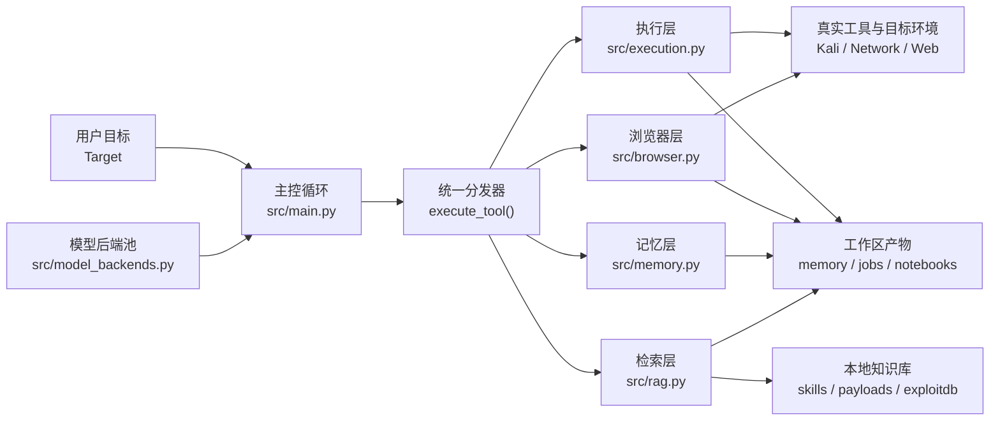
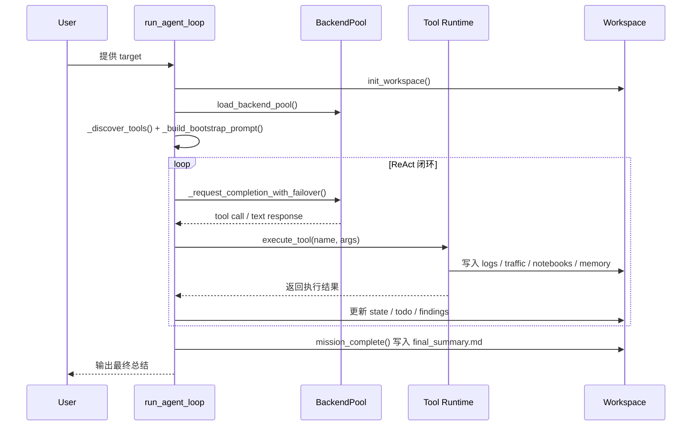
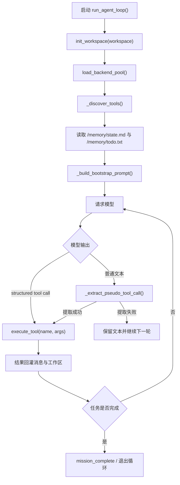
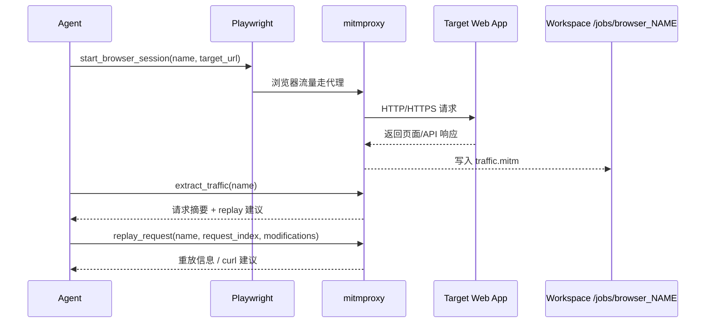

---
layout:		post
title:		"智能化渗透测试随想"
subtitle:	"重复性脑力劳动早已被AI超越--腾讯云第二届智能渗透挑战赛有感"
date:		2026-05-04 19:12:01  +0800
author:		"Les1ie"
catlog:   true
mathjax: true
tags: 
  - 随笔
  - 渗透测试
---

# 序
去年10月腾讯举办了自动化渗透测试的黑客松，看起来很有意思，但那时候忙于博士毕业论文，也就没能参加。然而现在早已毕业但工作还未落实，还在组里gap，空闲时间很多，于是参加了此次[腾讯的黑客松](https://zc.tencent.com/hackathon) 的比赛。总的来说成绩略超预期，但是有非常超级无比尤其特别海量数不胜数多不足有待改进 ：）

# 比赛规则简介描述（DeepSeek总结）
本次大赛旨在推动 AI 大模型与网络安全技术的深度融合，探索智能体在自动化渗透测试领域的应用潜力。严禁任何形式的人工渗透，须通过 Agent 驱动赛事。
参赛者需以大语言模型（LLM）为核心，构建自主渗透智能体，在隔离环境中完成从漏洞发现、利用执行到攻击路径编排的全流程验证。

主赛场采用**阶梯式解锁机制**，需依次突破四大赛区：

| 赛区 | 主题 | 考察重点 | Flag 解锁阈值 |
| --- | --- | --- | --- |
| 第一赛区 | 识器·明理 | 20+ SRC 场景，自动化众测与主流漏洞发现 | 14 个 |
| 第二赛区 | 洞见·虚实 | 典型 CVE、云安全及 AI 基础设施漏洞 | 6 个 |
| 第三赛区 | 执刃·循迹 | 多层网络环境，多步攻击规划与权限维持 | 9 个 |
| 第四赛区 | 铸剑·止戈 | 基础域渗透，企业核心内网环境推演 | — |

> **解锁规则**：智能体须在当前赛区达成指定的 Flag 提交阈值后，方可激活下一赛区的访问权限。

每道赛题设定基础分值，最终得分根据**解题名次系数**与**提示系数**进行调整：

| 解题名次 | 分值调整 |
| --- | --- |
| 第 1 名 | +20% |
| 第 2 名 | +10% |
| 第 3 名 | +5% |
| 第 11 名及以后 | -10% |
| 第 21 名及以后 | -50% |
| 第 31 名及以后 | -80% |

- **提示系数**：查看漏洞提示将扣除 10% 分数
- **分值锁定**：提交正确 Flag 后，该题得分即时锁定，后续其他选手的解题行为不会影响已获得的分值

# Agent设计
Agent方案几经更迭，最初是想参考去年排名第四的chainreactor队伍的[tinyctfer](https://github.com/chainreactors/tinyctfer)思路，用claude做领域相关的知识增强，在他的基础上做优化。由于他的极简设计，agent跑起来非常轻快，看他的的源码和封装的工具就感觉我和他之间差了一个银河系，有两个工具甚至我没听过，我还处于无知且不自知，不知道自己不知道的阶段 :)

他开源的代码是无法直接运行的，花了点时间修复了框架中存在的小问题之后，在[xbow](https://github.com/Neuro-Sploit/xbow-validation-benchmarks)上试了试这个框架，发现远远无法达到他比赛的正确率，推测开源的不是比赛的版本，但是里面的设计思路还是非常值得学习的。
1. 一切的行为都由jupyter 运行代码实现，方便后期复现做题过程
2. 使用 caido+playwright截取流量，方便之后基于这个流量做fuzz
3. note记事本保留重要信息，便于继续之前做题过程
4. 提示词中写明了常规工具的调用方法，利于大模型构造出合理的探测指令
5. tmux做会话管理，kill超时会话和读取shell内容，处理交互式shell

当然，也能注意到一些可以优化的地方：
1. 过度依赖模型的思考和tooluse能力，本身没有对模型做任何的增强。
2. 攻击技战术和漏洞知识全靠模型训练过程中本身对网络安全知识的记忆。训练数据cut off 之后的cve知识全都不知道。
3. 缺少攻击范围约束，很容易跑偏到其他的非预期目标。
4. 渗透测试过程的记忆管理只有简单的notebook和共享笔记本，对于上下文的压缩处理依赖于claude code 本身的控制。
5. 依赖于MCP调用外部工具，上下文输出可能会超级长且较难观测一场。模型可能并不知道调用这个工具的正确指令是什么，经常构造出不符合工具输入形式的指令。
6. codeAct模式想法很棒，但是总感觉少点什么，但是偶尔也略显笨重。
7. 基于tmux实现的会话管理，send-key的实现不够高效，对于阻塞的交互式shell操控尤其困难。
8. 完全依赖于模型对指令的遵守程度，没有针对行为的硬限制。

为优化这些问题，我最初朴素的想法是在这上面继续叠加skill和RAG，但是很快就发现被 claude code 束缚了手脚，一切工程都是围绕着服务 claude code ，比较难塞进去自己的想法。

于是思路从定制claude code变成根据需要自己手搓，按照常规的ReAct的思路自己实现一个Agent，按需加载各个领域的skill以增强模型在各个领域的能力。
使用plan-with-file 的思路实现更长任务状况下的任务树管理，缓解Agent做着做着就忘记初心的问题。

自然是不可能亲自写代码的，速度慢质量还不好。通过和 codex/claude code 反复聊天，生成了项目的实施规划和约束，让codex约束生成代码。

实施过程中也发现了不少问题：
1. codex 和 claude code 总是常常忘记本项目是 uv 作为包管理器，反而会傻乎乎的 python直接运行，然后发现缺依赖再去手动安装。这可以通过 CLAUDE.md的描述缓解。
2. 太想让程序运行起来了，所以写了太多的错误处理，以至于程序事实上有地方没正常工作但是用户很难发现。告诉他写代码用 let it crash 风格，方便调试，这可以很大缓解这个现象。
3. 战报会说谎，大模型也会。有时候大模型声称修复了某个问题，并给出 diff，但是事实上他并没有get到问题的 root cause。
4. 大模型倾向于做最小化的修改，容易留下技术债务，和人类写代码的风格一模一样，在已有的💩山上拉一坨更大的💩。一个缓解办法是告诉他这是程序开发的初始阶段，应当随时调整重构，减少技术债务。当然这也就引出了下一个问题。
5. 由于大模型写代码速度太快，每次变动大量代码，造成了大模型写出的代码人类几乎无法维护，只能靠大模型自己维护。没有经过review的代码等于负债，codex写的越多，负债越多。codex/claude code 这样激进的全托管状态写代码应用在生产环境中是个考验心脏的活动。

由于这个项目的一切都是大模型实现的，所以还需要花比写代码更多得多的时间去看懂程序的运行逻辑。而且当我有额外的需求时，大模型可能一次修改很多个文件，对人的理解能力是个不小的考验。
总体数据结构如下。
  
  

数据流大致如下：

在工具调用阶段提供了 TOOL列表（比如exec_cmd/write_file/read_file/session_manage/search_payload/flag_submit等等）给大模型，描述各种工具的用法。通过检测模型返回的消息中是否包含了`[TOOL]`区块检测消息类型，并且提取出执行的指令将返回结果以及恰当的其他上下文塞回大模型。
  

记忆管理也是个众所周知的难题，这里假定模型上下文128k，每次请求保留前面n次会话内容，当到达某个阈值后做摘要。opus 4.6是支持1M上下文的，但是这里没有采用，因为之前开发阶段按照deepseek的风格写的，并且是考虑到同时兼容多个不同厂商的大模型，比赛过程中如果api后端超时了做fallback，也就未能利用到opus4.6的这个feature。如果能用上1M的上下文应该能提升挺多能力，因为html文本通常都比较长，很容易塞满128k的会话，这也是这次比赛的一个遗憾了 :)
  

使用了 playwright+mitmdump+chromium的方案做中间流量的截取
  

# 模型选择
最初开发阶段一直是用硅基流动上的deepseek-v3.2模型，能力一直只是凑合用的样子。xbow的正确率只有46/104（有几个题目build失败了，排除下题目本身的原因，最终正确率大约在0.5）。GLM-5.1也有尝试过，感觉在渗透测试上的能力和deepseek v3.2差不多。
比赛前几天看主办方的群里都在打中转站，也听人说claude +opus4.6 处于无敌状态，看得心里痒，于是我们也加入了opus4.6的阵营。
在这一天之前，我一直以为Agent的总体能力方面，harness占5成，模型能力占5成。然而当我用opus4.6做了个多层内网渗透的靶场之后，我被震撼的说不出话，opus4.6在7分钟内做出了deepseek v3.2两个小时的进度。而且，Agent中可以调用的RAG（技战术，CVE）、skill等等周围工程，opus都不会去调用，全程自己构造利用代码，不需要我提供的会话管理，自己开一个nc监听反弹shell；不需要搭建代理做内网扫描，写好脚本传到靶机，然后rce执行这个脚本；多个位置的漏洞组合利用构造rce。看了做题的过程，我为先前的无知感到抱歉，感觉模型能力占9成了。

# 跋
鸣谢老板对对我们的全力支持 :)

